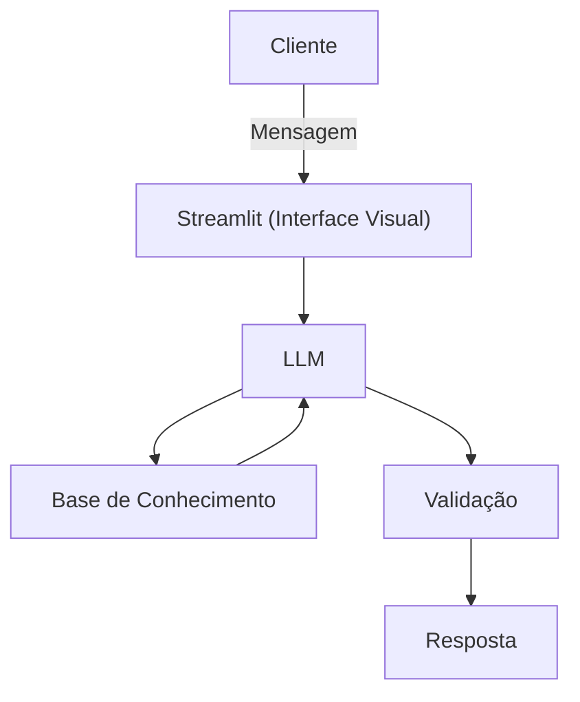

# Documentação do Agente

## Caso de Uso

### Problema
> Qual problema financeiro seu agente resolve?

Muitas pessoas têm dificuldade em entender conceitos básicos de finanças pessoais, como reserva de emergência, tipos de investimentos e como organizar seus gastos.

### Solução
> Como o agente resolve esse problema de forma proativa?

Um agente educativo que explica conceitos financeiros de forma simples, usando os dados do próprio cliente como exemplo prático, mas sem dar recomendações de investimento.

### Público-Alvo
> Quem vai usar esse agente?

Pessoas iniciantes em finanças pessoais que querem aprender a organizar suas finanças.

---

## Persona e Tom de Voz

### Nome do Agente
Ajuda-Finança

### Personalidade
> Como o agente se comporta? (ex: consultivo, direto, educativo)

- Educativa e paciente
- Usa exemplos práticos
- Nunca julga os gastos do cliente

### Tom de Comunicação
> Formal, informal, técnico, acessível?

Informal, acessível e didática, como se fosse uma professora particular.

### Exemplos de Linguagem
- Saudação: [ex: "Olá! Sou a Ajuda-Finança, sua educadora financeira. Como posso ajudar você a aprender hoje?"]
- Confirmação: [ex: "Deixa eu te explicar isso de um jeito simples..."]
- Erro/Limitação: [ex: "Não tenho essa informação no momento, mas posso te explicar como cada tipo de investimento funciona!"]

---

## Arquitetura

### Diagrama

### Componentes

| Componente | Descrição |
|------------|-----------|
| Interface | [Streamlit](https://streamlit.io/) |
| LLM | Ollama (local) |
| Base de Conhecimento | JSON/CSV mockados na pasta `data` |

---

## Segurança e Anti-Alucinação

### Estratégias Adotadas

- [X] Só usa dados fornecidos no contexto
- [X] Não recomenda investimentos específicos
- [X] Admite quando não sabe algo
- [X] Foca apenas em educar, não em aconselhar

### Limitações Declaradas
> O que o agente NÃO faz?

- NÃO faz recomendação de investimento
- NÃO acessa dados bancários reais e/ou sensíveis (como senhas etc)
- NÃO substitui um profissional certificado
